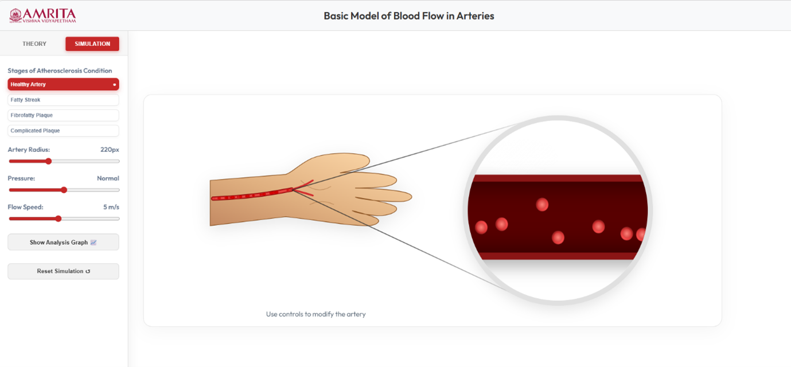
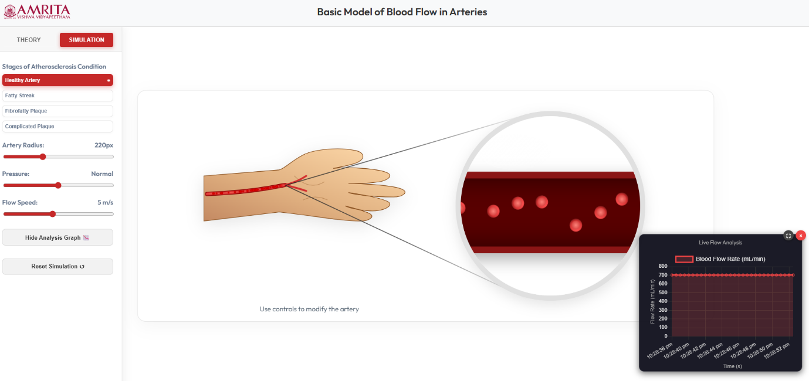
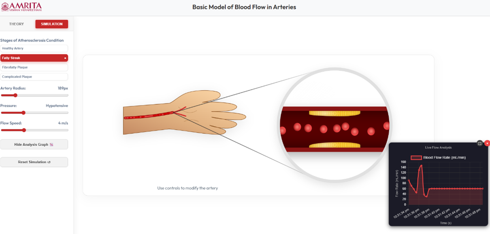
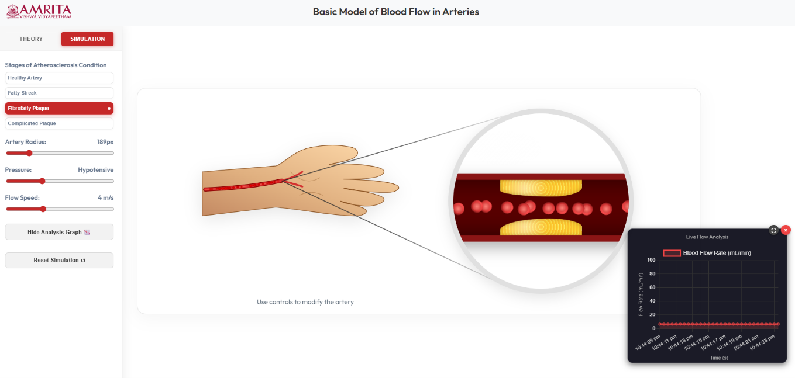
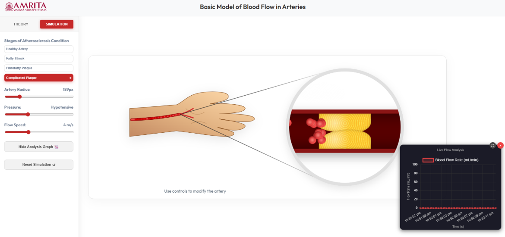

### Steps to work the simulator 

1. Users can open the simulator window. The GUI displays a human circulatory system model with the heart and major arteries highlighted.

  

&nbsp;

&nbsp;
 

2. Instruction was provided at the bottom as “click on the blinking red point to start”. Identify the blinking red point on the model and begin the simulation.

&nbsp;

3. Once clicking on the blinking point, the simulator opens to the main simulation interface.

  

&nbsp;

&nbsp;

4. The GUI is provided with different selection tabs. From the left control panel, users were allowed to select different structural conditions of artery by choosing the options under “Stages of Atherosclerosis Condition”. User can select Healthy Artery (default), Fatty Streak, Fibrofatty Plaque and Complicated Plaque and observe the flow of blood in different physiological conditions.

&nbsp;
 
5. In the GUI, users were allowed to modify key physiological parameters using sliders. The left panel has a slider to adjust the diameter of the artery (influences the blood flow capacity), a slider to set the pressure level (affects the driving force of blood flow), and a slider to adjust the flow speed (controls the movement of blood cells).

&nbsp;
 
6. The central panel with the artery model in the arm (zoomed circular view), users can observe the movement of blood cells and the pattern inside the artery. In healthy conditions, the blood flow appears to be smooth and uniform (Laminar flow).

&nbsp;
 
7. Click on the “Show Analysis Graph” to view a graphical representation of flow parameters.

  

&nbsp;

&nbsp;
 
8. Click on the Reset simulation button to return to the initial state of experimentation.

&nbsp;
 
9. In case of fatty streak condition, the artery model updates to show initial plaque deposition along the vessel walls. The yellow deposits (fatty streaks) along the inner arterial wall cause slight narrowing of the lumen.

  

&nbsp;

&nbsp;

10. From the simulation, user can analyse the blood flow behaviour in fatty streak condition comparing to healthy conditions. In fatty streak condition, the blow begins to show mild disturbance near plaque regions and causes slight reduction in the flow efficiency.

&nbsp;
 
11. From the analysis graph, users can observe changes in blood flow rate over time. Minor fluctuations were observed comparing to healthy artery.

&nbsp;
 
12. In case of fibro fatty plaque condition, the artery model updates to show advanced plaque accumulation in the arterial wall. Thicker yellow deposit along the inner arterial wall causes significant reduction in the lumen diameter.

  

&nbsp;

&nbsp;
 
13. Comparing with healthy conditions, the flow becomes more restricted and shows increased disturbance and irregular motion near plaque regions and a reduced flow uniformity.

&nbsp;
 
14. From the analysis graph, users can notice a lower blood flow rate and reduced stability compared to healthy and fatty streak conditions.

&nbsp;
 
15. In case of a complicated plaque condition, the artery model updates to show a severely diseased artery. Large plaque accumulation in the arterial wall significantly blocks the artery.

  

&nbsp;

&nbsp;

16. The simulation allows the users to observe the structural changes, such as large plaque buildup significantly blocking the artery and severely narrowing the lumen and causes irregular surfaces or clot-like formations in the vessel.

&nbsp;
 
17. The user can observe the blood flow in a highly disturbed and non-uniform way, and from the analysis graph, the blood flow rate drops drastically, and the flow may appear unstable or near zero in severe obstructions.

&nbsp;
 
18. The user can reset the simulation and return to the initial stage of experimentation.
