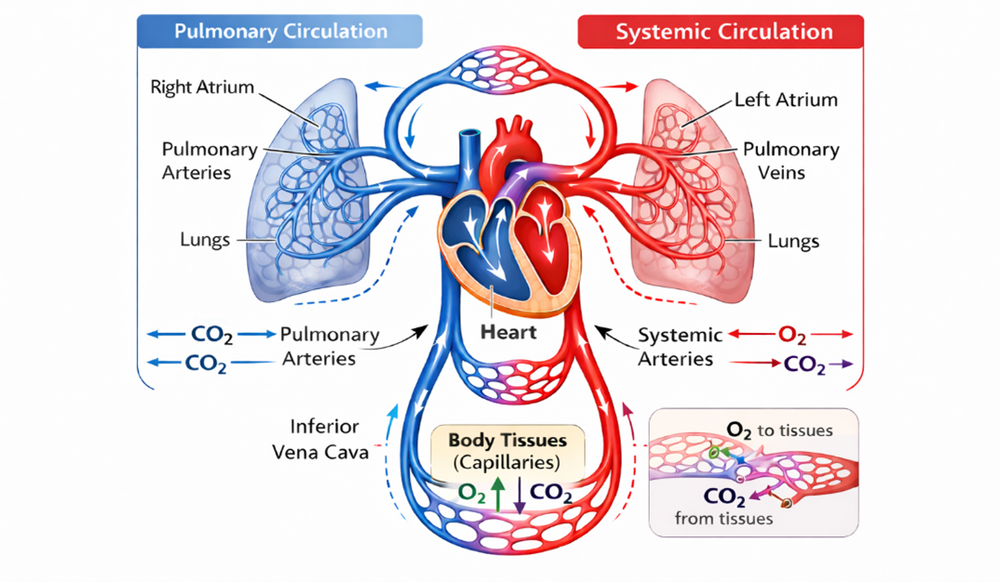
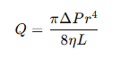

### Introduction
Blood circulation is one of the most fundamental physiological functions that sustains life in the human body. The circulatory system, which includes the heart, blood vessels, and blood, functions as complex transport system responsible for the delivery of oxygen, nutrients, hormones, and immune factors from the body tissues while removing waste products such as carbon dioxide and toxins. The blood circulation in the body ensures that cells maintain their metabolic activities and that organs function efficiently. The blood flow in the arteries is governed by hemodynamic principles like pressure gradients, vessel diameter, viscosity of the blood, and vascular resistance. Normal flow of blood in the arteries ensures proper supply of blood to the organs and tissues. Abnormalities in the flow of blood in the arteries may result in various cardiovascular diseases like atherosclerosis, hypertension, and thrombosis. In healthy arteries, the blood flow is in a smooth and laminar pattern, where blood layers move parallel to the vessel walls with minimal turbulence. Changes in the arterial structure or physiological parameters can significantly alter blood flow characteristics.

&nbsp;

### Blood -Its composition and flow in the human body
Blood is a special type of connective tissue that circulates throughout the body via the vascular system. It is made up of cells and a fluid component called plasma. The primary cellular components include red blood cells(erythrocytes), white blood cells (leukocytes), and platelets(thrombocytes). Red blood cells are responsible for carrying oxygen from the lungs to the body tissues via an iron-containing protein called haemoglobin, which combines with oxygen molecules. White blood cells are crucial to the body, as they are involved in the immune defence mechanism and protect against various diseases by eliminating pathogens. Platelets are used for blood clotting, which helps to stop bleeding when an injury occurs. The plasma, which makes up about 55 per cent of the total blood volume, contains water, proteins, electrolytes, nutrients, and waste products. All these components are used for carrying out physiological activities such as transportation, protection, regulation of body temperature, and maintaining homeostasis.

Blood flow is the movement of blood within the cardiovascular system, mainly due to the pumping action of the heart. The heart is a strong muscular pump that creates pressure to push blood through arteries, capillaries, and veins. The circulation route starts when oxygenated blood is pumped from the left ventricle to the aorta and then to systemic arteries to reach different organs and tissues. Deoxygenated blood then returns to the right side of the heart through the veins to be pumped to the lungs to get oxygenated. This creates two circuits that are connected: the systemic circulation and the pulmonary circulation (Fig.1). Arteries carry blood away from the heart at high pressure, while veins carry blood back to the heart at low pressure. Capillaries are the exchange areas where oxygen, nutrients, and wastes move between blood and tissues. The functionality of this transport system relies on the regulation of blood flow within the vascular system.

&nbsp;

  
   
  <i>Figure 1. Diagram illustrating the human circulatory system</i>

&nbsp;

### Classification and structure of Blood Vessels
Blood vessels constitute a wide network of tubular structures that are responsible for the transportation of blood in the human body. Blood vessels are key components of the cardiovascular system which supplies oxygen, nutrients, hormones, and other essential substances to tissues and removing waste products from tissues. Depending on their functions, structural characteristics, and locations in the cardiovascular system, blood vessels are mainly categorized into arteries, capillaries, and veins. Every blood vessel has distinct features that make it unique in performing its specific physiological functions in the process of blood circulation.
&nbsp;

**Arteries:** Arteries are blood vessels that transport blood away from the heart to various tissues and organs in the body. In the systemic circulation, arteries transport oxygenated blood, except for the pulmonary arteries, which transport deoxygenated blood to the lungs. Arteries are characterised by the strength and elasticity of their walls, which can withstand the pressure exerted by the contraction of the heart during the process of pumping blood. The structure of the artery consists of three layers, including the tunica intima, which is the endothelial lining that lines the blood vessels; the tunica media, which is the thick portion of the blood vessel; and the tunica adventitia, which is the outermost portion of the blood vessel. Arteries can expand during systole and recoil during diastole, thus allowing blood to flow to other parts of the circulatory system

**Capillaries:** Capillaries are the smallest and thinnest vessels, which are primarily involved in the exchange of substances with the blood and surrounding tissues. Capillaries are connected to the smallest arteries, referred to as arterioles, and the smallest veins, referred to as venules. Unlike other blood vessels, capillaries are composed of just one layer of endothelial cells and a basement membrane, which are very thin. This enables the effective exchange of substances such as oxygen, carbon dioxide, nutrients, hormones, and waste products through the process of diffusion. Capillaries are grouped into capillary beds, which are involved in the supply of blood to nearly all the cells of the human body. Capillaries are categorised into continuous capillaries, fenestrated capillaries, and sinusoidal capillaries, which are specialised for different physiological functions.

**Veins:** Veins are vessels that carry blood back to the heart after it has circulated in the body tissues. During systematic circulation, veins carry deoxygenated blood, except pulmonary veins, which carry oxygenated blood from the lungs to the heart. Compared to arteries, veins have thinner walls but larger diameters (lumens) since they contain lower blood pressure. Their walls are composed of three layers, like those of arteries: tunica intima, tunica media, and tunica adventitia. However, the media layer, tunica media, is thinner in veins than in arteries since they contain lower pressure. A unique characteristic of most veins, especially those in the limbs, is that they contain one-way valves that ensure that blood does not flow back. This ensures that blood is transported efficiently to the heart against gravity. Veins also serve as blood reservoirs, storing a significant amount of blood in the body.

&nbsp;

### Principle behind the Blood flow in Arteries
The fundamental principle of hemodynamics governs the blood flow in arteries, which regulate the flow of fluids through a biological system under the influence of both pressure and resistance. The human heart, a pumping organ, creates a pressure gradient, thereby pumping blood from areas with high pressure, such as the aorta, to areas with low pressure, such as the arterioles and capillaries. The difference in pressure is the main force that drives blood through arteries. The entire mechanism depends on various interactions involving cardiac output, structure, and physical properties.

One of the major factors that determines the blood flow in arteries is the vascular resistance, which is influenced by various factors such as the radius of the artery, the viscosity of the blood, and the length of the artery. Of these factors, the radius of the artery has a major effect on the rate of blood flow, as any small change in the diameter of the artery can result in considerable changes in the rate of flow. This relationship between the factors can be explained by Poiseuille’s principle, which highlights that the rate of blood flow in arteries is highly sensitive to changes in the radius of the artery. The smooth and elastic muscles in the arteries (arterial wall) actively regulate the vessel radius by the process of vasoconstriction and vasodilation, and thereby control the distribution of blood into the various organs.

The mathematical expression of Poiseuille’s Law is 
&nbsp;

  
   
  <i>Q = Blood flow rate 
ΔP = Pressure difference between two points 
r = Radius of the vessel 
η = Blood viscosity 
L = Length of the vessel 
</i>

&nbsp;
This equation shows that blood flow (𝑄) is directly proportional to the pressure gradient (Δ𝑃) and the fourth power of the vessel radius (𝑟4), while it is inversely proportional to blood viscosity (𝜂) and vessel length (L). However, the most important aspect of this equation is the fourth power proportionality to the vessel's radius, indicating that even the slightest decrease in the vessel's diameter, for example in the case of atherosclerosis, may severely reduce the rate of blood flow, while even the slightest increase in the vessel's radius, as in the case of vasodilation, significantly enhance the rate of blood flow.

&nbsp;

###  Arterial Blood flow in Atherosclerosis conditions

Atherosclerosis is a progressive vascular condition with the deposition of lipids and fibrous elements in the arterial wall, resulting in alterations in the structure and function of the vessels. As atherosclerosis progresses through various stages, from a healthy artery to complicated plaque, the size of the artery decreases, thus affecting the resistance in the vessels. These changes affect the hemodynamics of the vessels and thereby the flow of blood through the arteries. Understanding these stages is important for analysing the role of structure in the vessels in the development of cardiovascular diseases.

Normally, in a healthy artery, the wall is smooth and elastic, and unobstructed for efficient blood flow. The lumen or internal diameter is wide, and this results in minimal resistance and efficient blood flow. Blood flow is in a laminar nature, meaning it occurs in parallel layers with the highest velocity at the centre and lowest near the vessel walls. According to hemodynamic laws, the larger the radius of the artery, the better the flow, and this ensures efficient delivery of oxygen and nutrients. The elastic nature of the artery wall also allows for continuous flow during the cardiac cycle through the Windkessel effect. Thus, this condition represents an ideal physiological circulation with stable pressure and uniform shear stress.

The fatty streaks phase is defined as the earliest visible sign of atherosclerosis, characterised by the lipid accumulation in the inner lining (intima) of the artery. Although this phase has minimal effect on the lumen, it slightly affects the geometry of the blood vessel, causing a small increase in resistance and minor fluctuations in blood flow, particularly near the vessel walls. The blood flow is normally smooth, or laminar, in this phase, with minor fluctuations in shear stress that can trigger endothelial dysfunction. And minor reductions in vessel radius can start to affect blood flow due to the non-linear relationship with blood flow, thus initiating blood flow alterations.

In the fibrofatty plaque stage, the presence of lipids, fibrous tissue, and inflammatory cells causes a critical reduction in the vessel’s lumen. The vessel wall becomes thick and stiff, compromising its capability to stretch and accommodate the pulsating blood flow. This leads to a substantial rise in the resistance offered by the vessel and a corresponding fall in the rate of flow. The rate of flow increases, and the flow becomes turbulent. According to Poiseuille’s law, a small reduction in the vessel’s radius causes a critical reduction in the rate of flow. The law states that the rate of flow is proportional to the fourth power of the radius. Therefore, there is a possibility of tissues not receiving adequate blood flow, leading to ischemia.

The complex plaque stage signifies the presence of advanced atherosclerotic disease, wherein the vessel lumen has already narrowed or has been obstructed, which is accompanied by plaque rupture and thrombus or clot formation. This condition drastically increases vascular resistance and disrupts normal blood flow, often resulting in turbulent flow patterns and significant energy loss. Such a drastic reduction in the radius of the vessel has already led to a drastic reduction in the flow of blood, as per the law of Poiseuille. Thus, the drastic reduction in the radius of the vessel has already led to the flow of blood being reduced exponentially.